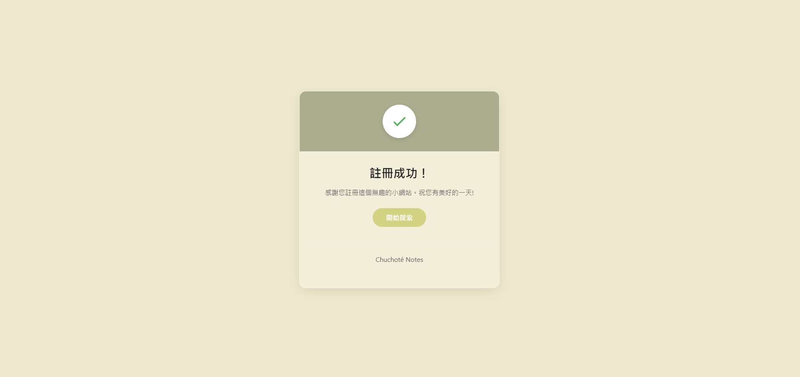

# Thanks-for-signing-up
> This is a site that appears after users confirm their email. It serves as an entry point and redirects them to the main website.

## Introduction
1. Set it as the **email redirect URL** in your authentication provider (e.g., Supabase)
2. After users confirm their email, they'll land here and get redirected to your actual app

